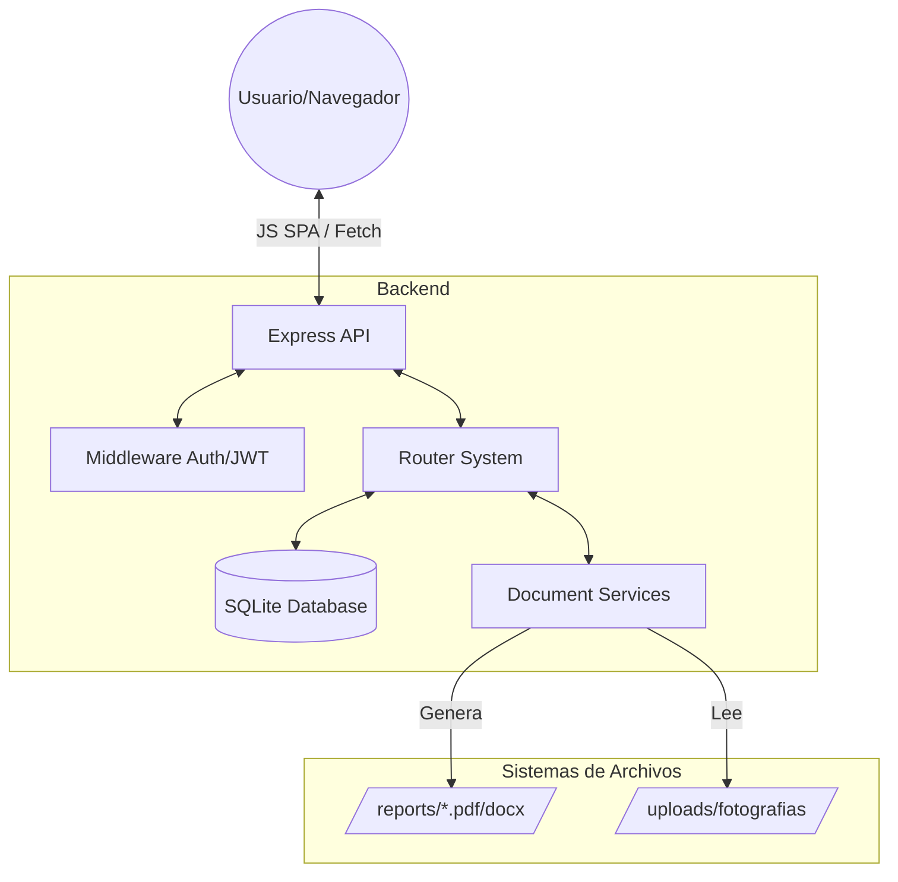
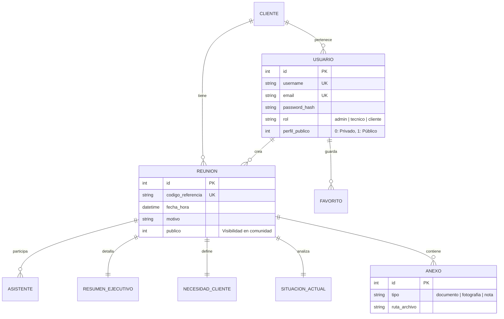

# Walkthrough Técnico: Sistema de Gestión de Reuniones (Reker Tech)

Este documento ofrece un análisis exhaustivo y técnico del sistema de gestión de reuniones de **Reker Tech Solutions**, detallando su arquitectura, base de datos, flujos de datos y servicios internos.

## 🏗️ Arquitectura de Referencia

El sistema utiliza un stack **Node.js/Express** monolítico con servicios desacoplados para la generación de documentos y una base de datos **SQLite** (vía `sql.js`) para persistencia local.

### Esquema de Arquitectura


## 🗄️ Modelo de Datos (ERD)

La base de datos está diseñada para capturar la complejidad de una reunión de ingeniería, separando los datos estructurados por secciones.



## 🛠️ Detalle de Servicios Críticos

### 1. Sistema de Informes (Engine de Generación)
El servicio `pdfGenerator.js` es una implementación avanzada de `pdfkit` que utiliza un sistema de buffers y layouts dinámicos:
- **Layout Corporativo**: Aplica márgenes (60pt), colores HSL y tipografía Helvética equilibrada.
- **Secciones Dinámicas**:
    - **Sección 1-2**: Fichas tabulares generadas mediante `addTable` con cálculo de altura dinámica.
    - **Sección 3-5**: Boxes de texto informativos con placeholders si no hay datos.
- **Inyección de Anexos**: Procesa la ruta de imágenes en `uploads/` y las inserta en un grid de 2 columnas con redimensionamiento automático.

### 2. Sistema de Comunidad y Visibilidad
El proyecto implementa un sistema de "Social Engineering" interno:
- **Toggle de Visibilidad**: Cada reunión o cliente tiene un flag `publico`.
- **Favs System**: Los técnicos pueden "favorecer" recursos públicos de otros compañeros, lo que inserta una referencia en la tabla `favoritos`.
- **API de Compartición**: `/api/compartir` permite el envío directo de recursos entre nombres de usuario (@username).

## 📡 Endpoints Clave (API)

| Método | Ruta | Descripción | Seguridad |
| :--- | :--- | :--- | :--- |
| `POST` | `/api/auth/login` | Autenticación y firma de token JWT. | Público |
| `GET` | `/api/reuniones/:id` | Agregación completa de datos (Join de 6 tablas). | JWT |
| `GET` | `/api/informes/:id/pdf` | Generación on-the-fly y descarga de reporte. | JWT |
| `PUT` | `/api/compartir/mi-perfil` | Toggle de perfil @username público. | JWT |

## ⚙️ Flujo de Generación de Referencias
El código implementa una lógica de negocio única para códigos de referencia corporativos:
```javascript
// FORMATO: RT-AÑO-CORRELATIVO (ej: RT-2026-001)
async function generarCodigoReferencia() {
    const year = new Date().getFullYear();
    const count = db.prepare('SELECT COUNT(*) as total FROM reuniones WHERE...').get();
    const num = (count.total + 1).toString().padStart(3, '0');
    return `RT-${year}-${num}`;
}
```

## 📂 Estructura de Proyecto Pro
```text
.
├── src/
│   ├── database/     # DB (init.js) y SQL Schema
│   ├── routes/       # Handlers por dominio (auth, clientes, reuniones...)
│   ├── services/     # Lógica pesada (PDFKit/Docx)
│   └── middleware/   # JWT Auth & Role Authorization
├── public/           # SPA Frontend (CSS/JS modules)
└── uploads/          # Almacén de binarios (Documentos/Fotos)
```

---
Este sistema representa una solución técnica robusta para la digitalización de procesos industriales, garantizando integridad de datos y presentación profesional.
